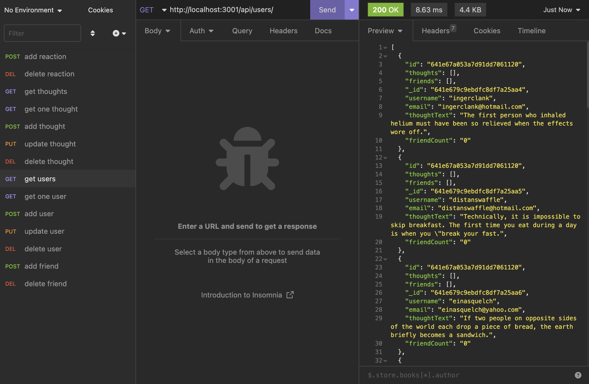
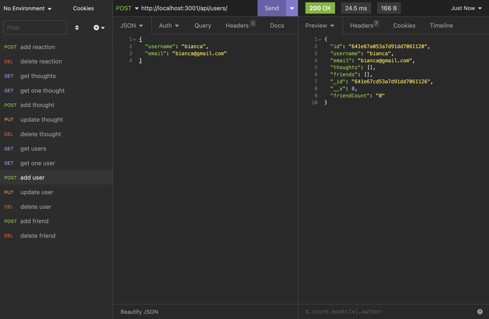
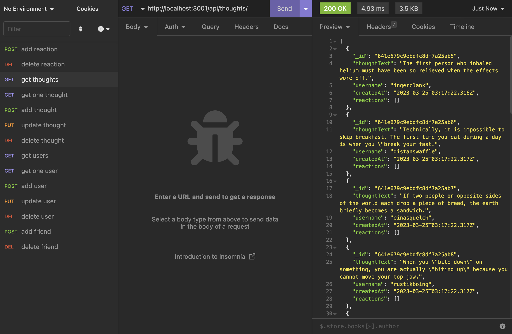
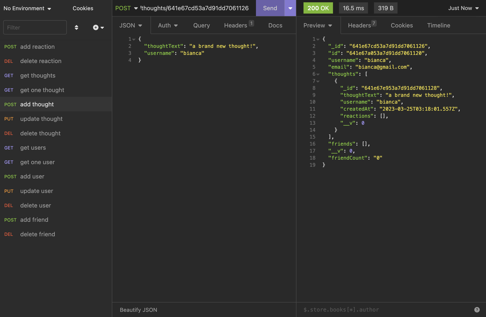

# A Social Network API

## Description

This is the backend of a social app. Users can add thoughts, reactions and friends. This is made with MongoDB.

## Table of Contents

- [Installation](#installation)
- [Screenshots](#screenshots)
- [License](#license)
- [Questions](#questions)

## Installation

npm i, npm run seed, npm run dev

## Screenshots

Demo: https://drive.google.com/file/d/1Jeab--aGfVn4KIf-kxvMSeFLfvnBa7le/view

## License

MIT  
https://opensource.org/licenses/MIT

## Questions

Contact information for any questions: 
bianca.frazier90@gmail.com 
https://github.com/b-frazier/
